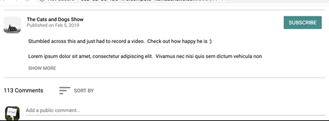
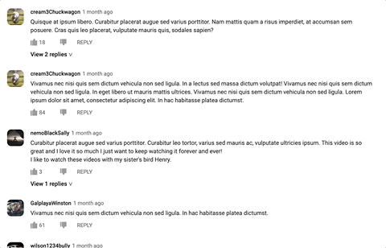

# Media Player Subscribe / Chat Service

> Subscribe and comments/replies services in support of a service-oriented architecture implementation of a streaming media player.

## Tech Stack

  - Javascript
  - Node.js
  - Express
  - React.js
  - PostgreSQL
  - Styled-Components
  - AWS EC2
  - Webpack
  - Babel
  - Jest

## Features

### Benchmarking
Page load speed was a key-metric for this application; we used Google PageSpeed Insights speed score to benchmark page-load speeds.  I optimized my service to a score of 99 out of a possible 100 (see below) through a combination of server-side-rendering, lazy-loading, and various production deployment strategies.  This was for page load of a single-page app including all the features that follow.


*Note: each feature that follows will include a sample of code relevant to that feature.  You are of course welcome to explore the repo more fully; these samples are simply provided for your convenience.*

### Back-End / API
Included API to provide details on a queried video, with a seperate route to provide similar channels should a user subscribe to the current channel.  Post routes also included in API to accept comments or likes / dislikes of others' comments.

*Code sample: Server-side-rendering of HTML*

```javascript
import React from 'react';
import ReactDOMServer from 'react-dom/server';
import VideoDetailsAndComments from '../client/components/index.jsx';
import Layout from './layout';
import { ServerStyleSheet } from 'styled-components';


const renderToHTML = (props) => {
  const sheet = new ServerStyleSheet();
  const component = React.createElement(VideoDetailsAndComments, props);
  const body = ReactDOMServer.renderToString(sheet.collectStyles(component));
  const styles = sheet.getStyleTags();
  return Layout(styles, body, props);
};

export { renderToHTML };
```

### Front-End / UI
*Note in addition to a code sample, each UI feature will include a gif of the feature in action*

##### Suggests other channel subscriptions when user subscribes to current channel:


*Code sample: Implementation of scrolling*

```javascript
scroll(direction) {
  var distance = 631;
  var frequency = 5;
  var pixelsEachInterval = direction === 'right' ? 15 : -15;
  var pixelsMoved = 0;
  var animateScroll;
  var check = () => {
    if (pixelsMoved >= distance) {
      clearInterval(animateScroll);
      this.checkScrollStatus();
      return;
    } else {
      this.suggestions.current.scrollLeft += pixelsEachInterval;
      pixelsMoved += Math.abs(pixelsEachInterval);
    }
  };
  animateScroll = setInterval(check, frequency);
}
```

##### Allows user to expand or collapse the description of the current video:



*Code sample: State for expand / collapse lifted to parent; passed down as prop*

```javascript
const Description = (props) => {
  return (
    <Container>
      <DescBlock collapse={props.collapseView}>{props.desc}</DescBlock>
      <ShowView onClick={() => props.handleShowClick()}>{props.collapseView ? 'SHOW MORE' : 'SHOW LESS'}</ShowView>
    </Container>
  );
};
```

##### Allows user to add a public comment:


*Code sample: Underline component (2px height div) animation effect on focus*

```javascript
var CommentInput = styled.input`
  display: block;
  position: relative;
  margin-bottom: 0;
  min-width: 100%;
  outline: none;
  border: none;
  line-height: 21px;
  color: rgba(17, 17, 17, 0.6);
  cursor: text;
  font-family: Roboto, Arial, sans-serif;
  font-size: 14px;
  font-weight: 400;
  &:focus {
    color: rgb(10, 10, 10);
  }
  &:focus ~ ${Underline} {
    transform: scale(1);
  }
`;
```

##### Allows comments to be sorted based on most recent or most popular:


*Code sample: Sort function passed from parent components to SortSelection component*

```javascript
const onTopCommentsSelect = () => {
  props.sortByLikes();
  props.onSortBlur();
};

return (
  <SortSelection>
    <Option readOnly autoFocus={true} onBlur={props.onSortBlur} onClick={onTopCommentsSelect} value="Top Comments"></Option>
    <Option readOnly onMouseDown={props.sortByDate} value="Newest First"></Option>
  </SortSelection>
);
```

##### Allows for interaction through likes / dislikes and @ messages:



*Code sample: Post request helper on like or dislike*

```javascript
const commentFeelingPost = (username, commentId, action, feelingAsBool, successCallback, errorCallback) => {
  console.log('post request issued');
  $.ajax({
    url: '/watch/commentFeeling',
    method: 'POST',
    data: {
      username: username,
      commentId: commentId,
      action: action,
      feeling: feelingAsBool
    },
    success: (data, status) => successCallback(data, status),
    error: (err, errDesc) => errorCallback(err, errDesc)
  });
};
```
